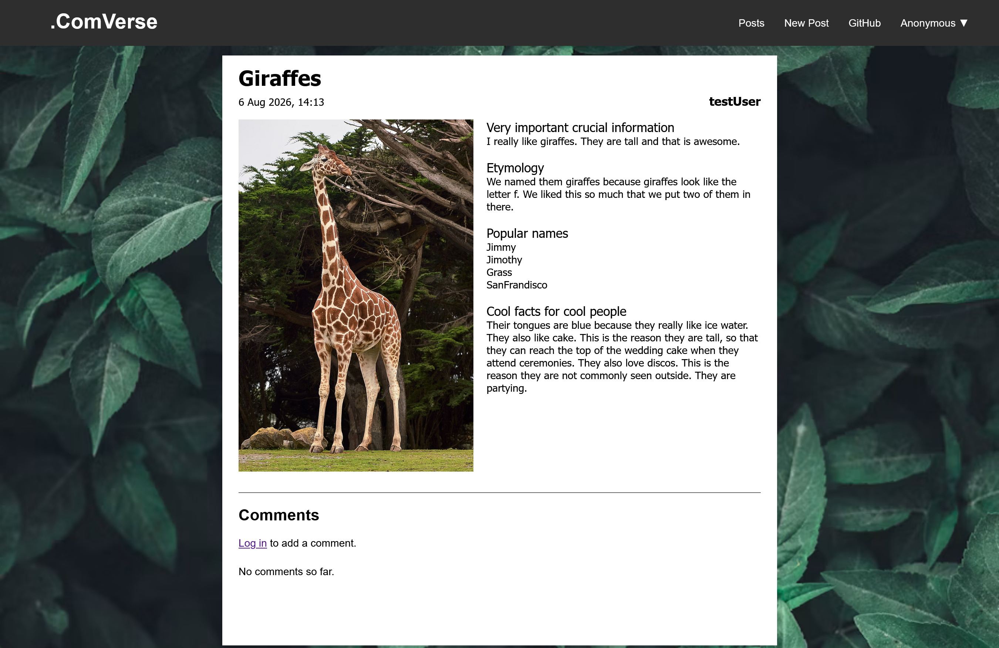
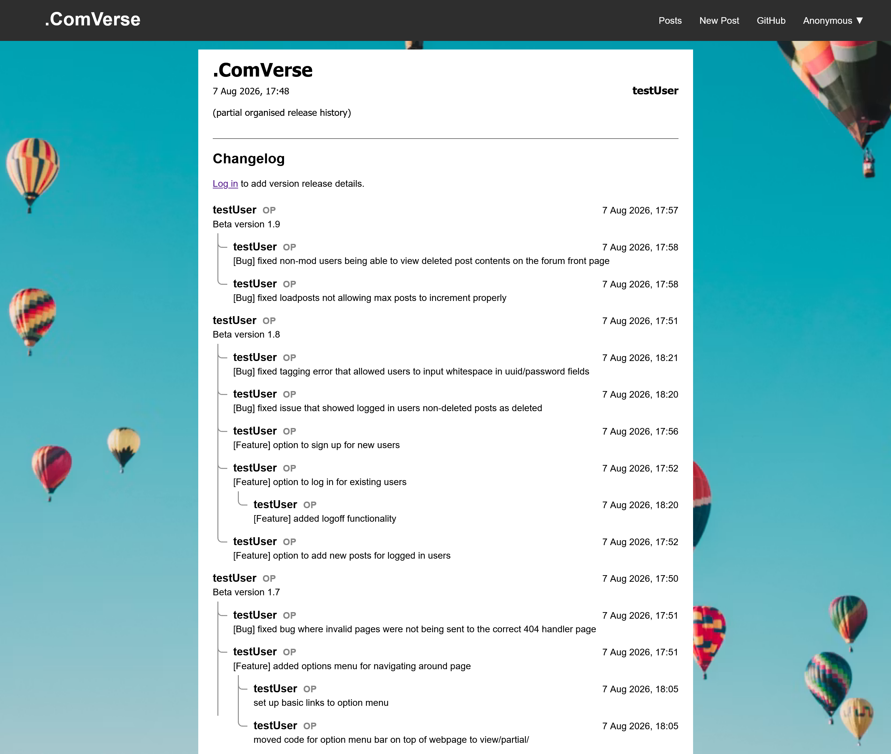

# .ComVerse
There are a thousand types of sites you can create on the internet.
Have you ever realised that most are essentially identical?

.ComVerse is a free-to-use web application template which can be used to set up a internet forum out of the box, or 
easily tweaked into various other formats. What's the point of building the same framework over and over again from 
scratch? There's only so much knowledge we can gain from it. By using 
abstraction, we can finally focus our attention on the important things instead: how to make the program fulfill the 
specific purpose we needed it for.

## Some example formats
Created by making minor edits to the template. Click the header to expand the corresponding image.

    
Encyclopedia

    

    
Blog post

    

    
Project management board

    

    
Program changelog

    

    
Employee working hour tracking system (to be added)

    

    
Course pre-requisite visualisation (to be added)

    

## Open source details
Please see LICENSE.md for details and additional credits.